# GitLab MR Conflict Detector - Architecture Documentation

This document provides a comprehensive overview of the GitLab MR Conflict Detector architecture, including component diagrams, integration points, and dependencies.

## System Overview

The GitLab MR Conflict Detector is a Java application designed to detect potential merge conflicts between multiple merge requests in GitLab repositories. It integrates with the GitLab API to fetch merge request data, analyzes potential conflicts, and can update GitLab with the results.

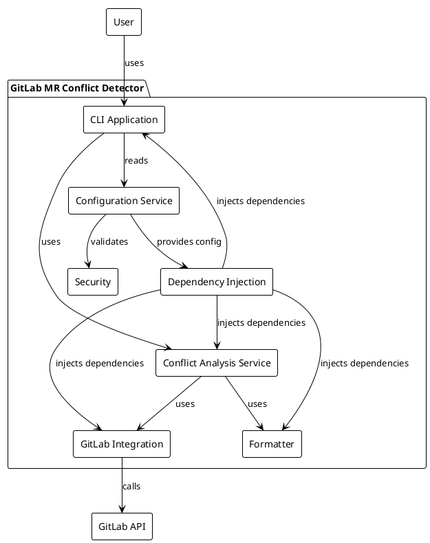

## Component Architecture

The application is organized into several key components, each with specific responsibilities:

### CLI Component

The CLI component provides the command-line interface for users to interact with the application.

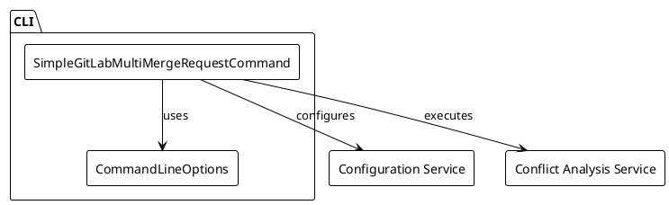

### Configuration Component

The Configuration component manages application settings and GitLab credentials.

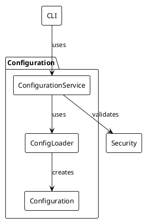

### Core Component

The Core component contains the business logic for detecting conflicts between merge requests.

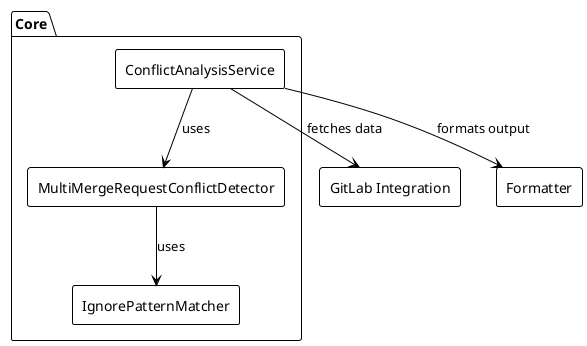

### GitLab Integration Component

The GitLab Integration component handles communication with the GitLab API.

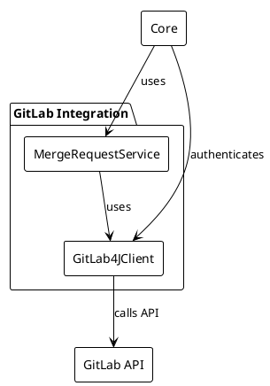

### Formatter Component

The Formatter component handles the formatting of conflict detection results.

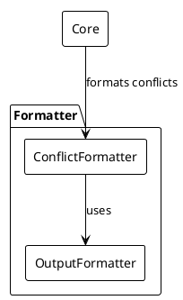

## Integration Points

The application integrates with external systems and components:

### GitLab API Integration

The primary external integration is with the GitLab API:

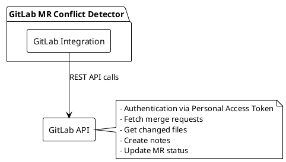

## Data Flow

The following diagram illustrates the data flow through the system:

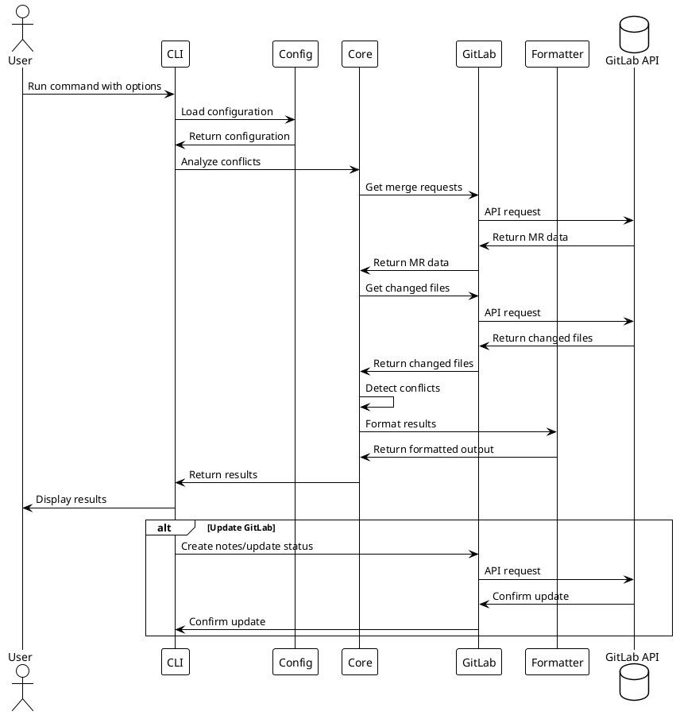

## Dependencies

The application has the following key dependencies:

### Internal Dependencies

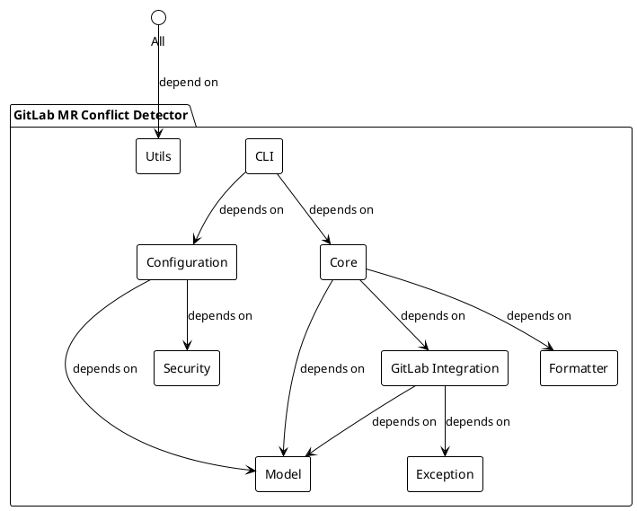

### External Dependencies

- **GitLab4J-API**: Java client for GitLab API
- **Picocli**: Command-line interface framework
- **Jackson**: YAML parsing for configuration files
- **SLF4J/Logback**: Logging framework
- **Lombok**: Reduces boilerplate code

## Security Considerations

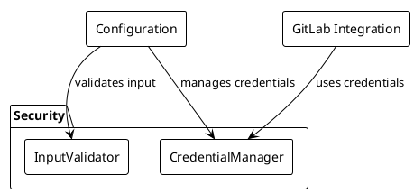

The application implements several security measures:
- Input validation to prevent injection attacks
- Secure credential handling (environment variables, secure storage)
- Token validation and minimal permission checking
- No exposure of GitLab token in logs or error messages

## Deployment Architecture

The application can be deployed in various ways:

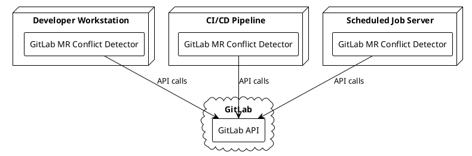

## Extension Points

The application is designed with several extension points:

1. **New Conflict Detection Algorithms**: The strategy pattern allows for new conflict detection algorithms.
2. **Additional Output Formats**: The formatter component can be extended with new output formats.
3. **Alternative GitLab API Clients**: The GitLab integration is abstracted behind interfaces.
4. **Custom Configuration Sources**: The configuration system supports multiple sources.
