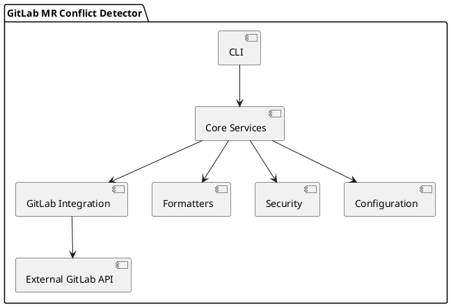
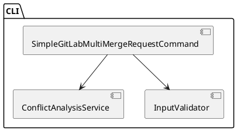
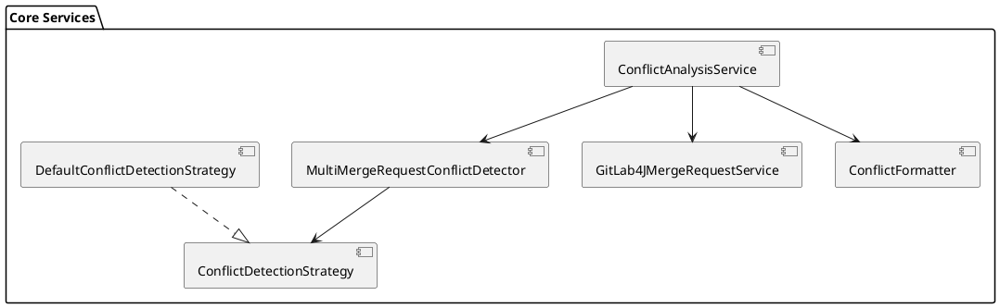
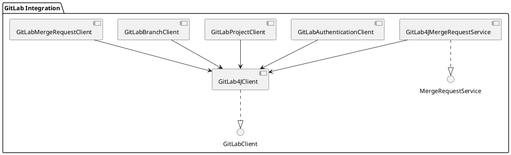
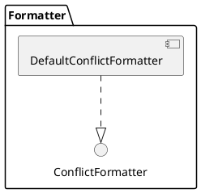
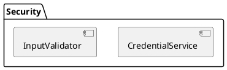
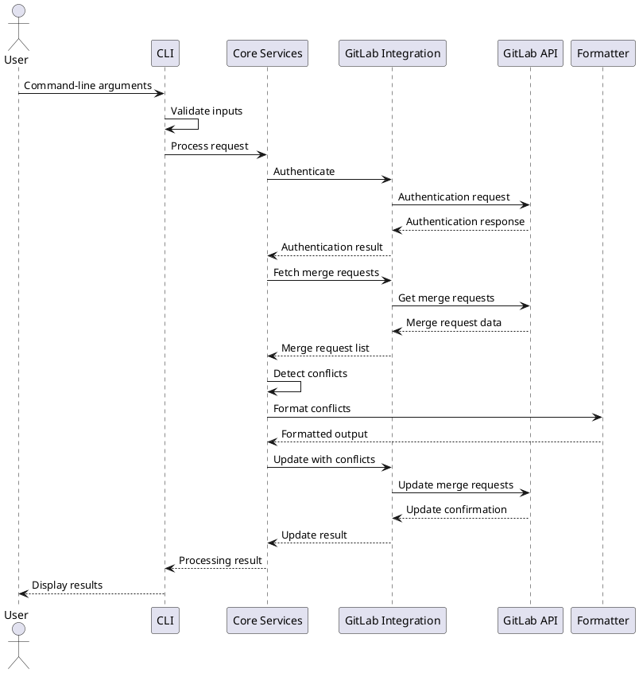
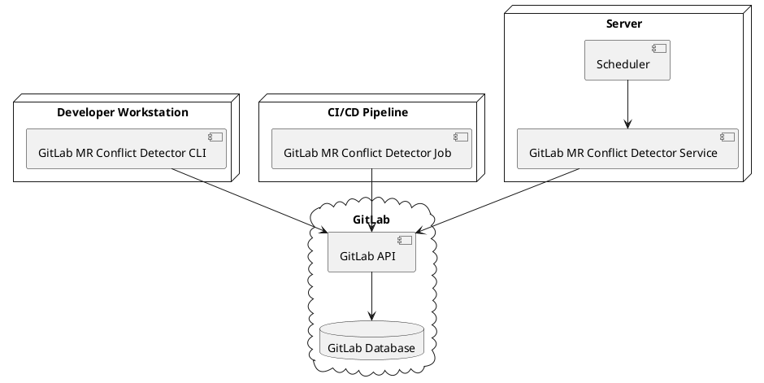
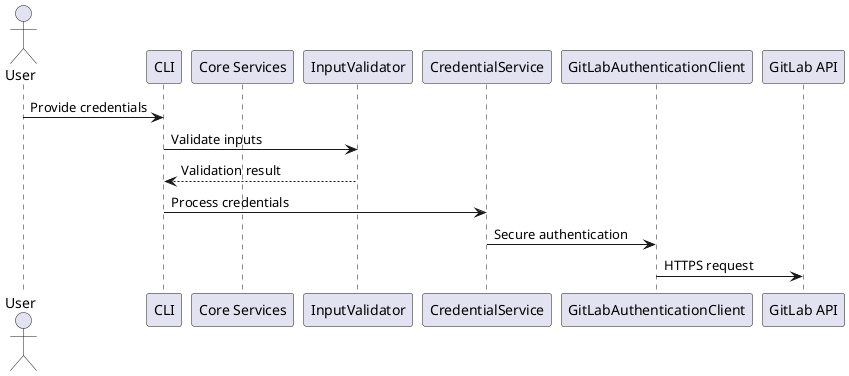
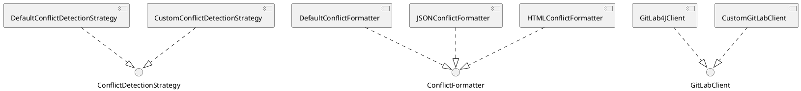

# GitLab MR Conflict Detector - Architecture Documentation

## Overview

This document provides a comprehensive overview of the GitLab MR Conflict Detector architecture, including component diagrams, integration points, and dependencies.

## System Architecture

The GitLab MR Conflict Detector is designed with a modular architecture following SOLID principles. The system is organized into several key components that interact to detect conflicts between merge requests in GitLab.

### High-Level Architecture

The system follows a layered architecture:

1. **CLI Layer**: Handles command-line arguments and user interaction
2. **Core Services Layer**: Contains the business logic for conflict detection
3. **Integration Layer**: Manages communication with GitLab API
4. **Utility Layers**: Includes formatters, security, and configuration components

## Component Diagrams

### CLI Component

The CLI component is responsible for:
- Parsing command-line arguments
- Validating user inputs
- Orchestrating the conflict detection process
- Displaying results to the user

### Core Services Component

The Core Services component is responsible for:
- Coordinating the conflict detection workflow
- Analyzing merge requests for conflicts
- Applying conflict detection strategies
- Formatting conflict information

### GitLab Integration Component

The GitLab Integration component is responsible for:
- Authenticating with GitLab API
- Fetching merge requests from GitLab
- Updating merge requests with conflict information
- Handling GitLab API errors and exceptions

### Formatter Component

The Formatter component is responsible for:
- Converting conflict data into human-readable formats
- Generating formatted output for console display
- Creating formatted notes for GitLab merge requests

### Security Component

The Security component is responsible for:
- Securely handling GitLab credentials
- Validating user inputs to prevent security vulnerabilities
- Ensuring secure communication with GitLab API

## Integration Points

### GitLab API Integration

The GitLab MR Conflict Detector integrates with the GitLab API through the GitLab4J library. The integration points include:

1. **Authentication**:
   - Personal access token authentication
   - Validation of token permissions

2. **Project Access**:
   - Verification of access to specified GitLab projects
   - Fetching project metadata

3. **Merge Request Operations**:
   - Fetching open merge requests
   - Adding comments to merge requests
   - Updating merge request labels
   - Retrieving merge request details (branches, files changed)

4. **Branch Operations**:
   - Fetching branch information
   - Comparing branches for conflicts

### Command-Line Integration

The application integrates with the command-line interface through the Picocli library, which provides:

1. **Command-Line Argument Parsing**:
   - Support for various command-line options
   - Automatic help generation
   - Type conversion and validation

2. **Exit Code Handling**:
   - Standardized exit codes for different scenarios
   - Error reporting through exit codes

## Dependencies

### External Dependencies

The GitLab MR Conflict Detector relies on the following external dependencies:

1. **GitLab4J-API**:
   - Java client library for GitLab API
   - Handles HTTP communication with GitLab
   - Provides object models for GitLab resources

2. **Picocli**:
   - Command-line parsing framework
   - Handles argument parsing and validation
   - Generates help documentation

3. **Lombok**:
   - Reduces boilerplate code
   - Provides annotations for generating getters, setters, constructors, etc.

4. **SLF4J**:
   - Logging facade
   - Provides consistent logging interface

5. **Logback**:
   - Logging implementation
   - Configurable logging backend

### Internal Dependencies

The internal components have the following dependencies:

1. **CLI depends on**:
   - Core Services
   - Security (InputValidator)

2. **Core Services depend on**:
   - GitLab Integration
   - Formatters
   - Configuration

3. **GitLab Integration depends on**:
   - External GitLab API (via GitLab4J)

4. **All components depend on**:
   - Exception handling
   - Utility classes

## Data Flow

The data flow through the system follows this pattern:

1. User provides command-line arguments (GitLab URL, token, project ID, etc.)
2. CLI component validates inputs and passes them to Core Services
3. Core Services authenticate with GitLab and fetch merge requests
4. Conflict detection is performed on the merge requests
5. Conflicts are formatted for display
6. GitLab is updated with conflict information (if requested)
7. Results are displayed to the user

## Deployment Architecture

The GitLab MR Conflict Detector is designed to be deployed in various environments:

1. **Developer Workstation**:
   - Run directly from command line
   - Used for ad-hoc conflict detection

2. **CI/CD Pipeline**:
   - Integrated into GitLab CI/CD
   - Run automatically on schedule or trigger
   - Reports conflicts as part of pipeline

3. **Server Deployment**:
   - Run as a service on a server
   - Scheduled execution
   - Centralized conflict detection for multiple projects

## Security Architecture

The security architecture of the GitLab MR Conflict Detector includes:

1. **Authentication Security**:
   - Secure handling of GitLab tokens
   - No storage of credentials in plain text
   - Support for environment variables for credential storage

2. **Input Validation**:
   - Validation of all user inputs
   - Prevention of injection attacks
   - Secure handling of URLs and IDs

3. **API Communication Security**:
   - HTTPS communication with GitLab API
   - Proper error handling for API failures
   - Rate limiting awareness

## Extension Points

The GitLab MR Conflict Detector is designed with several extension points:

1. **Custom Conflict Detection Strategies**:
   - Implement the `ConflictDetectionStrategy` interface
   - Provide custom logic for determining conflicts

2. **Custom Formatters**:
   - Implement the `ConflictFormatter` interface
   - Create custom output formats (JSON, HTML, etc.)

3. **Alternative GitLab Clients**:
   - Implement the `GitLabClient` interface
   - Support different GitLab API libraries or versions

4. **Additional Command-Line Options**:
   - Extend the CLI component with new options
   - Support additional use cases

