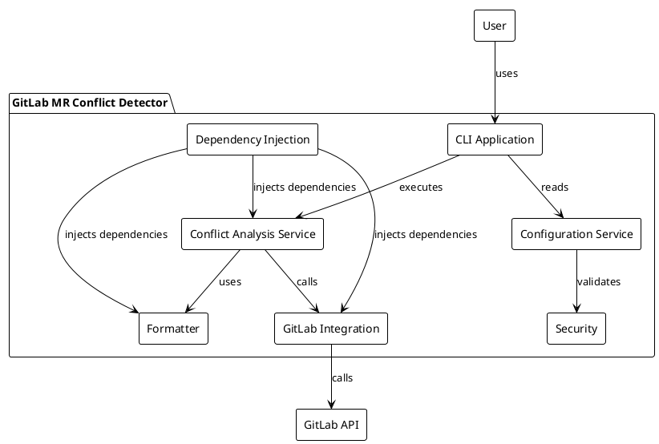
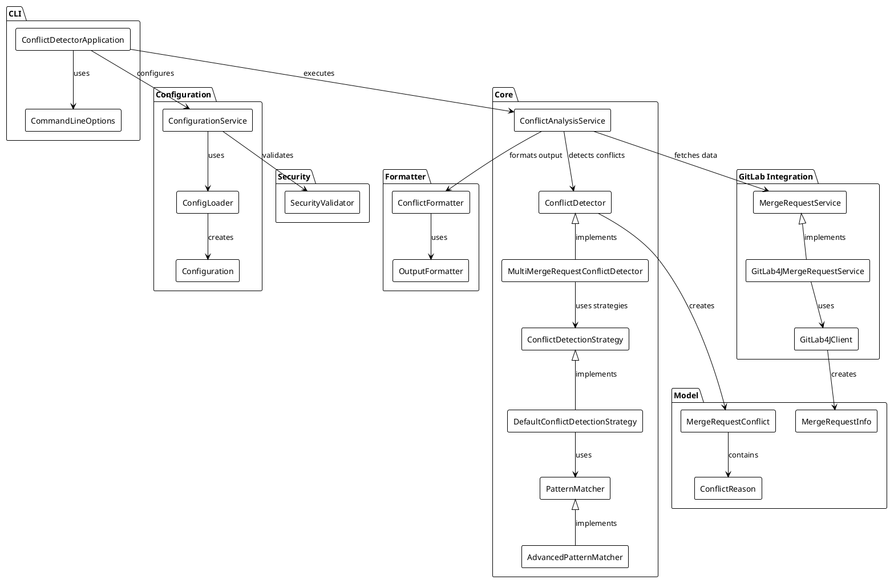
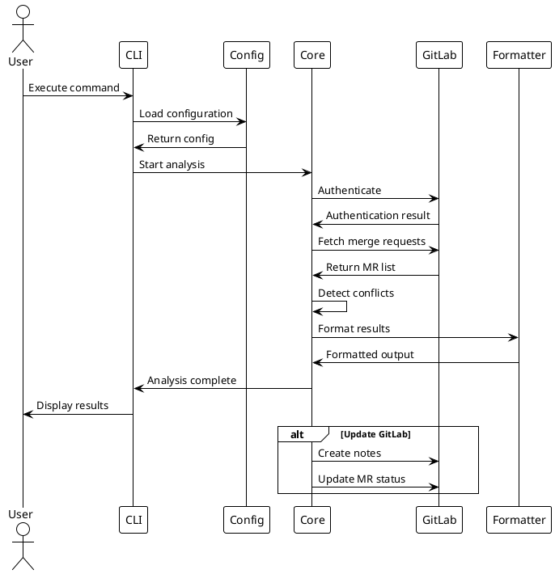
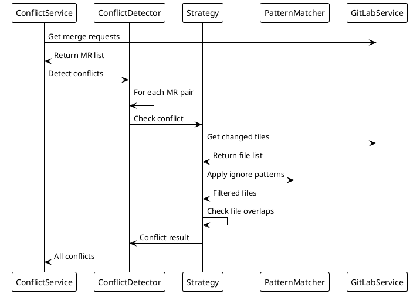

# GitLab MR Conflict Detector - Architecture Documentation

This document provides a comprehensive overview of the GitLab MR Conflict Detector architecture, including component diagrams, integration points, and dependencies.

## System Overview

The GitLab MR Conflict Detector is a Java application designed to detect potential merge conflicts between multiple merge requests in GitLab repositories. It integrates with the GitLab API to fetch merge request data, analyzes potential conflicts, and can update GitLab with the results.

### High-Level Architecture

### Component Architecture

## Component Details

### CLI Component

The CLI component provides the command-line interface for users to interact with the application.

**Key Classes:**
- `ConflictDetectorApplication`: Main CLI command class implementing Picocli's `Callable<Integer>`
- `CommandLineOptions`: Data class containing all CLI options and arguments

**Responsibilities:**
- Parsing command-line arguments
- Validating user input
- Configuring the application based on user input
- Orchestrating the workflow of the application
- Handling errors and providing appropriate feedback to the user
- Setting up logging based on verbosity level

### Configuration Component

The Configuration component manages application settings and GitLab credentials.

**Key Classes:**
- `ConfigurationService`: Main service for configuration management
- `ConfigLoader`: Loads configuration from various sources (files, environment variables, CLI args)
- `Configuration`: Data class representing the application configuration

**Responsibilities:**
- Loading configuration from YAML files
- Reading environment variables
- Merging configuration from multiple sources
- Validating configuration completeness and correctness
- Providing configuration to other components

### Core Component

The Core component contains the business logic for detecting conflicts between merge requests.

**Key Classes:**
- `ConflictAnalysisService`: Main orchestrator of the conflict analysis process
- `ConflictDetector`: Interface defining conflict detection contract
- `MultiMergeRequestConflictDetector`: Implementation for multi-MR conflict detection
- `ConflictDetectionStrategy`: Strategy interface for different detection algorithms
- `DefaultConflictDetectionStrategy`: Default implementation of conflict detection
- `PatternMatcher`: Interface for pattern matching functionality
- `AdvancedPatternMatcher`: Advanced pattern matching with glob support

**Responsibilities:**
- Authenticating with GitLab
- Validating GitLab connection and project access
- Fetching merge requests from GitLab
- Detecting conflicts between merge requests using configurable strategies
- Applying ignore patterns to exclude files/directories
- Handling dependency relationships between merge requests
- Formatting conflicts for output
- Updating GitLab with conflict information

### GitLab Integration Component

The GitLab Integration component handles all interactions with the GitLab API.

**Key Classes:**
- `MergeRequestService`: Interface for GitLab merge request operations
- `GitLab4JMergeRequestService`: Implementation using GitLab4J library
- `GitLab4JClient`: Enhanced GitLab client with additional functionality

**Responsibilities:**
- Authenticating with GitLab API
- Fetching merge request data
- Getting changed files for merge requests
- Creating notes on merge requests
- Updating merge request status and labels
- Handling API rate limiting and errors

### Formatter Component

The Formatter component handles output formatting and display.

**Key Classes:**
- `ConflictFormatter`: Formats conflict information for display
- `OutputFormatter`: Handles different output formats (console, MD, etc.)

**Responsibilities:**
- Formatting conflict results for console output
- Generating structured output (MD format)
- Creating human-readable summaries
- Handling different verbosity levels

### Security Component

The Security component provides validation and security measures.

**Key Classes:**
- `SecurityValidator`: Validates configuration and input for security

**Responsibilities:**
- Validating GitLab tokens and permissions
- Sanitizing user input
- Ensuring secure configuration practices

## Interaction Flows

### Main Workflow Sequence

### Conflict Detection Sequence

## Design Patterns

### Strategy Pattern
The conflict detection uses the Strategy pattern to allow different conflict detection algorithms:
- `ConflictDetectionStrategy` interface defines the contract
- `DefaultConflictDetectionStrategy` provides the default implementation
- Additional strategies can be added without modifying existing code

### Dependency Injection
The application uses dependency injection for loose coupling:
- All major components are injected rather than created directly
- Facilitates testing with mock objects
- Allows for easy configuration and component swapping

### Service Layer Pattern
Business logic is encapsulated in service classes:
- `ConflictAnalysisService` orchestrates the main workflow
- `MergeRequestService` handles GitLab interactions
- `ConfigurationService` manages configuration

## Performance Considerations

### API Rate Limiting
- GitLab API calls are batched where possible
- Caching is implemented for frequently accessed data
- Exponential backoff for rate limit handling

### Memory Management
- Streaming processing for large merge request lists
- Lazy loading of merge request details
- Efficient data structures for conflict detection

### Scalability
- Parallel processing for independent conflict checks
- Configurable thread pools for API calls
- Pagination support for large projects

## Error Handling

### Exception Hierarchy
- Custom exceptions for different error types
- Proper error propagation through layers
- User-friendly error messages

### Retry Logic
- Automatic retry for transient failures
- Configurable retry policies

## Security Considerations

### Token Management
- Secure storage of GitLab tokens
- Token validation and scope checking
- No token logging or exposure

### Input Validation
- Sanitization of all user inputs
- Validation of configuration parameters
- Protection against injection attacks

## Dependencies

### External Dependencies
- **GitLab4J API**: GitLab API client library
- **Jackson**: JSON/YAML processing
- **Picocli**: CLI framework
- **SLF4J + Logback**: Logging
- **Caffeine**: Caching

### Internal Dependencies
- Core depends on GitLab Integration for data
- CLI depends on Core for business logic
- All components depend on Configuration
- Formatter is used by Core for output

## Testing Strategy

### Unit Testing
- Comprehensive unit tests for all components
- Mock objects for external dependencies
- Test coverage > 80%

### Integration Testing
- WireMock for GitLab API testing
- Testcontainers for database testing
- End-to-end workflow testing
